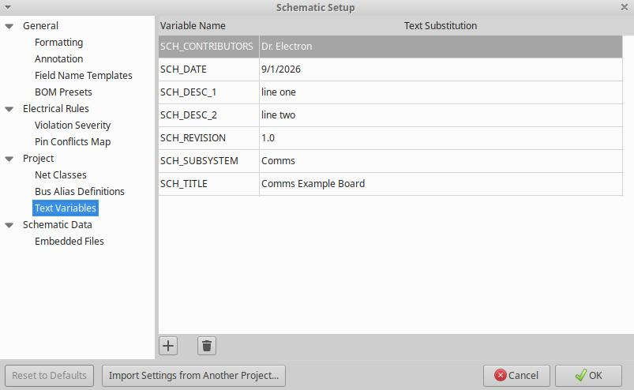

<!-- kicad_template/README.md -->

# Generic KiCad 10.0 Project Template

This repository is a template for the electrical team to use for board
design. It can be easily cloned, edited, and uploaded to your own
github for collaboration between members.

<font size=-1>Template forked courtesy of the BU Mars Rover Club!</font>

## File Structure

- ```/kicad/``` contains all of the KiCad 10.0 project files
- ```/datasheets/``` should contain all of the .pdf files for the important components
- ```/calculations/``` should include any significant calculations that led to a component choice or value choice
- ```/cad/``` should include any .DXF, .STEP or .STL files used with your board, or a link to your OnShape document

## Using this Template in KiCad 10.0

Download KiCad [here](https://www.kicad.org/download/). I currently recommend version 10.

1. Click the ```Use this Template``` to make a personal copy of this repository.

2. Set the repository name to your desired name: PROJECT_NAME

3. Clone the repository to your local machine

4. Open up KiCad 10.0 and open the default project in the ```kicad/default``` directory.

5. Click ```save as``` and save it to the ```kicad``` directory under your desired name PROJECT_NAME.

6. The folder tree should look like this:

```
PROJECT_NAME/
├── kicad/
│   ├── template/
│   │   ├── template.kicad_dru
│   │   ├── template.kicad_pcb
│   │   ├── template.kicad_pro
│   │   ├── template.kicad_sch
│   │   └── sheet.kicad_wks
│   └── PROJECT_NAME/
│       ├── PROJECT_NAME.kicad_dru
│       ├── PROJECT_NAME.kicad_pcb
│       ├── PROJECT_NAME.kicad_pro
│       ├── PROJECT_NAME.kicad_sch
│       └── sheet.kicad_wks
├── datasheets
├── calculations
├── img
├── README.md
└── LICENSE
```

7. Delete the ```kicad/template``` directory.

8. Open up your newly renamed project, ```PROJECT_NAME.kicad_pro```, and then open the schematic editor.

9. Click ```File -> Schematic Setup```, then under ```Project -> Text Variables```, populate all of the fields with the correct information such as ```contributors``` and board ```revision```. Then click OK and you should see the bottom right of the schematic and layout correctly update. See a screenshots below:

<br>

<div align="center">
    
    <!--  -->
</div>

<br>

8. Edit this README.md file, initialize the git repository, and start working on your project!
